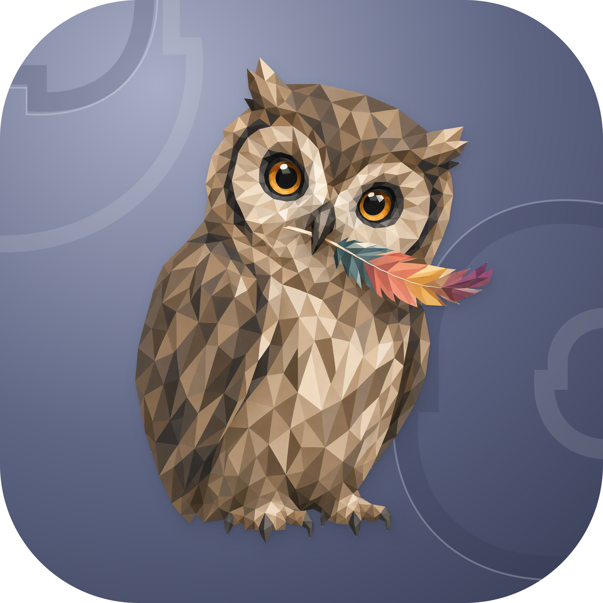

<p align="center">
  
</p>
<h1 align="center">Owl</h1>
<p align="center">Inspect system metrics, processes, and anomaly alerts from the macOS menu bar.</p>
<p align="center">
  <a href="../README.md">简体中文</a>
</p>

## What it does

Owl is a menu bar app for macOS 14 and later. It reads the unified log stream and samples system metrics, turning repeated crashes, resource pressure, and device connection problems into alerts that can help investigate a slow, hot, or unexpectedly waking Mac.

Collection and analysis run locally, without an account or external service. Detection depends on the logs and hardware metrics macOS exposes; readings such as temperature may be unavailable on some devices. Preferences are stored in UserDefaults. Recent alerts live in process memory and are not restored after restarting the app.

## Features

- **System overview**: CPU and per-core usage, load, memory and swap, disk, network traffic, battery, and available temperature sensors.
- **Anomaly alerts**: Analyze logs using thresholds, event rates, denial signatures, and paired states. Metric detectors also cover sustained CPU usage, system thermal state, memory pressure, swap, and disk usage.
- **Menu bar feedback**: Check severity through the icon color and status text, then open the panel for active alerts, recent records, and copyable details.
- **Process inspection**: Inspect current high-resource processes and cumulative CPU time, memory, and instance statistics.
- **Settings**: Toggle individual detectors, switch between Chinese and English, choose an appearance, and configure launch at login and system notifications.
- **Adaptive sampling**: Collect the full set of metrics while the panel is open; reduce sampling when it closes while retaining data needed for anomaly detection.

Log detection covers these signals:

| Category | Signals |
| --- | --- |
| Processes and permissions | Crash loops, abnormal exit signals, app hangs, sandbox and TCC denials |
| Resource pressure | Thermal throttling, APFS flush delays, Jetsam memory termination |
| Networks and devices | Wi-Fi signal degradation, connection failures, Bluetooth disconnects, USB errors |
| Sleep | Unreleased sleep assertions and frequent DarkWake events |

## Usage

Download the `Owl-*.dmg` provided on a [GitHub release](https://github.com/nocoo/owl/releases), open it, and move `Owl.app` to `/Applications`. Each package corresponds to its release version; main contains the latest source.

Click the menu bar icon to open the panel. Right-click for settings or to quit. System notifications require permission in macOS and must be enabled in Owl; disabling them leaves menu bar alerts available.

## Development

Requires macOS 14+ and an Xcode toolchain that supports Swift 6 (Xcode 16+). The project uses Swift Package Manager with no third-party Swift package dependencies.

```bash
git clone https://github.com/nocoo/owl.git
cd owl
swift build
swift run Owl
```

The SPM executable can run the UI and collection logic, but it has no complete app bundle, so system notifications are disabled.

Build an app bundle:

```bash
bash scripts/build.sh --sign "Apple Development: Your Name (TEAMID)"
```

The output is `build/release/Owl.app`. The script defaults to the `Apple Development` signing identity; provide an identity available on your machine. See [package-dmg.sh](../scripts/package-dmg.sh) and [notarize.sh](../scripts/notarize.sh) for the packaging and notarization entry points.

Main source locations:

| Path | Contents |
| --- | --- |
| [Sources/Owl](../Sources/Owl) | AppKit menu bar, app lifecycle, and notifications |
| [Sources/OwlCore](../Sources/OwlCore) | Metrics, detectors, alert state, and SwiftUI views |
| [Sources/HIDThermalBridge](../Sources/HIDThermalBridge) | Objective-C bridge for Apple Silicon temperature sensors |
| [Tests/OwlCoreTests](../Tests/OwlCoreTests) | Unit tests and detection pipeline integration tests |

## Tests

Run on macOS with the Xcode toolchain configured:

```bash
swift test
swift test --filter EndToEnd
```

The first command runs all tests. The second runs integration tests from log entries through the detection pipeline and alert state. Integration tests use constructed log data; some system metric and sensor tests read the current Mac. Check menu bar interactions and system notifications manually in an app bundle.

## Stack

| Technology | Role |
| --- | --- |
| Swift / Swift Concurrency | App logic, asynchronous log streams, and metric sampling |
| SwiftUI / AppKit | Panels, settings windows, and the menu bar |
| macOS Unified Logging | System events collected through `log stream` |
| IOKit / Mach / libproc | Hardware, memory, CPU, and process metrics |
| Objective-C / IOHID | Apple Silicon temperature readings |
| UserDefaults | Local preferences |
| Swift Package Manager / Swift Testing | Builds and automated tests |

## Documentation

- [Architecture](02-architecture.md)
- [Log pattern design](03-patterns.md)
- [Detection algorithms](04-detection-algorithms.md)
- [Brand assets](../assets/brand/README.md)

## License

[MIT](../LICENSE)
